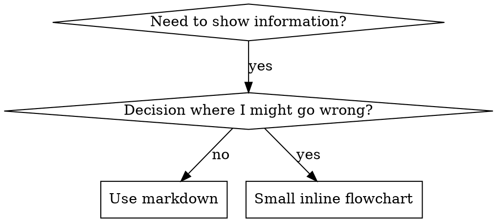

# Writing Agents

## Overview

**Writing agents is applying TDD to process documentation.**

Agents are defined as `.agent.md` files, located in the `.github/agents/` directory. Each agent consists of YAML frontmatter and a Markdown body.

**Core principle:** If you don't first confirm failure without the agent, you can't know whether the agent teaches the right thing.

**REQUIRED BACKGROUND:** You must understand the RED-GREEN-REFACTOR cycle of the `test-driven-development` agent.

## What is an Agent?

**An Agent** is a `.agent.md` file in VS Code Copilot containing specialized instructions for a particular workflow or task type.

**Agents are:** step-by-step guides for specific workflows, decision trees, quality criteria

**Agents are NOT:** general coding tips, one-off scripts, project-specific configuration (that belongs in AGENTS.md)

## When to Create an Agent

**Create when:**
- A workflow is non-intuitive and causes repeated mistakes
- A pattern you want to reuse across multiple projects
- Others need to follow this workflow too

**Don't create for:**
- One-off tasks
- Standard practices already well documented
- Project-specific configuration (put it in AGENTS.md)

## TDD Mapping for Agents

| TDD Concept | Agent Creation |
|-------------|----------------|
| **Test case** | Scenario performing the task without the agent |
| **Production code** | Agent file (`.agent.md`) |
| **Test fails (RED)** | Confirm quality degradation or rule violations when working without the agent |
| **Test passes (GREEN)** | Confirm rule compliance after applying the agent |
| **Refactor** | Find and close loopholes while preserving existing behavior |

## Agent File Structure

### YAML Frontmatter

All `.agent.md` files begin with YAML frontmatter:

```yaml
---
description: "Use when [triggering conditions] - [key behavior]"
model: inherit
handoffs:
  - label: "English Label"
    agent: target-agent-name
    prompt: "Context to pass to target agent"
    send: false
---
```

**Required fields:**
- `description` — The conditions under which the agent activates. Starts with "Use when..."
- `model` — The model to use. Usually `inherit`

**Optional fields:**
- `handoffs` — Defines handoffs to other agents
  - `label` — Label for the handoff button
  - `agent` — The target agent's filename (excluding the `.agent.md` extension)
  - `prompt` — Context to pass to the target agent
  - `send: false` — Handoff after user confirmation (not automatic)
- `tools` — Restricts which tools the agent can use

### Description Writing Rules

**CRITICAL: Description = When to Use, NOT What the Agent Does**

Description should only describe trigger conditions. Do not summarize the agent's process or workflow.

```yaml
# BAD: Summarizes the workflow — AI may act on the description without reading the body
description: Use when executing plans - dispatches subagent per task with code review between tasks

# GOOD: Trigger conditions only
description: Use when executing implementation plans with independent tasks in the current session
```

### Directory Structure

```
.github/agents/
  agent-name.agent.md        # Agent file (required)
  agent-name/                 # Supporting files directory (optional)
    supporting-file.md        # Reference docs, prompts, etc.
```

**Flat namespace** — All agents are located in `.github/agents/`

**When to split into supporting files:**
1. Reference documents over 100 lines
2. Reusable prompts or scripts
3. Everything else: inline in the agent body

### Cross-Referencing Other Agents

When referencing other agents, use only the agent name and attach an explicit requirement marker:
- Good: `**REQUIRED:** Use the \`test-driven-development\` agent`
- Bad: `See skills/testing/test-driven-development` (unclear if required)

## Flowchart Usage



**Use flowcharts ONLY for:**
- Non-obvious decision points
- Process loops where you might stop too early
- "When to use A vs B" decisions

**Never use flowcharts for:**
- Reference material → Tables, lists
- Code examples → Markdown blocks
- Linear instructions → Numbered lists
- Labels without semantic meaning (step1, helper2)

## File Organization

### Self-Contained Agent
```
.github/agents/
  my-agent.agent.md    # All content inline
```
Use when: all content fits in one file

### Agent With Supporting Files
```
.github/agents/
  my-agent.agent.md       # Main logic
  my-agent/
    reference.md          # Reference document
    prompt-template.md    # Subagent prompt
```
Use when: reference docs are long or reusable prompts exist

## The Iron Law (Same as TDD Principles)

```
NO AGENT WITHOUT A FAILING TEST FIRST
```

Before creating a new agent, perform the task without the agent and confirm failure.
Before modifying an existing agent, first confirm the problem in its current state.

**No exceptions:**
- "Simple additions" are not exceptions
- "Documentation updates" are not exceptions
- Changes made without testing are not kept

**REQUIRED BACKGROUND:** The `test-driven-development` agent explains why this matters. The same principles apply to agent documentation.

## Common Rationalizations for Skipping Testing

| Excuse | Reality |
|--------|---------|
| "The agent is clear" | Clear to me ≠ clear to another AI. Test it. |
| "It's just reference documentation" | References have gaps too. Test it. |
| "Testing is overkill" | Untested agents always have problems. |
| "I'll test when a problem appears" | A problem = already failing. Test before deploying. |
| "I'm confident" | Overconfidence guarantees problems. Test anyway. |

## Bulletproofing Agents Against Rationalization

Agents that enforce discipline (TDD, etc.) must resist rationalization.

### Close Every Loophole Explicitly

Don't just state rules — explicitly prohibit specific workarounds:

```markdown
Write code before test? Delete it. Start over.

**No exceptions:**
- Don't keep it as "reference"
- Don't "adapt" it while writing tests
- Delete means delete
```

### Address "Spirit vs Letter" Arguments

Add a foundational principle early on:

```markdown
**Violating the letter of the rules is violating the spirit of the rules.**
```

### Build Rationalization Table

Record every rationalization found during baseline testing in a table.

## Deployment

Agent files are automatically copied to `~/.superpowers-copilot/agents/` by `extension.ts` when the extension activates. When adding a new agent:

1. Create the `.agent.md` file in `.github/agents/`
2. If there are supporting files, create a directory with the same name
3. Rebuild and activate the extension — it will be deployed automatically

No separate registration code needed — the directory copy works recursively.
